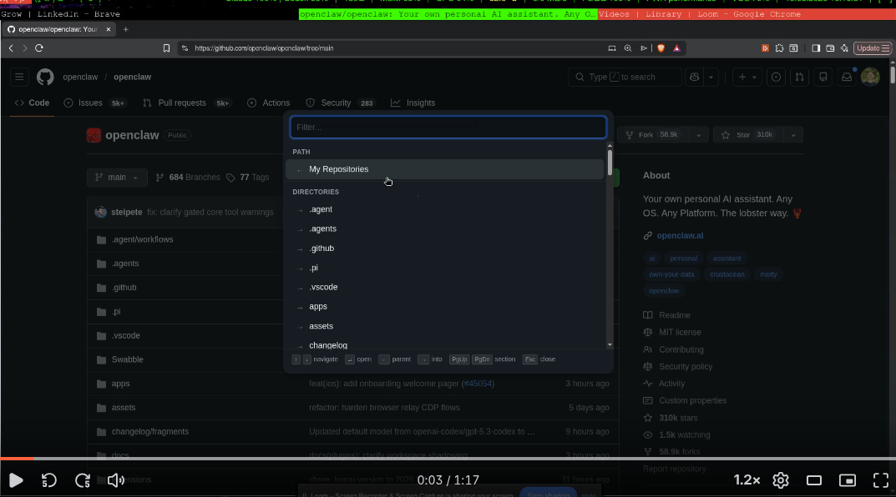

# GitHub Breadcrumb Navigator

Navigate through GitHub repositories and directories with a keyboard-driven overlay. It works both in repositories you own and in external repositories, and it always keeps your own repositories shortlisted so you can quickly jump between them. Press **Ctrl+B** on any GitHub page to open.

## Demo

## Quick Start

### 1. Install the extension

1. Open `chrome://extensions` in Chrome/Brave/Edge
2. Enable **Developer mode** (toggle in the top-right corner)
3. Click **Load unpacked** and select this project folder

### 2. Create a GitHub Personal Access Token

1. Go to [github.com/settings/tokens](https://github.com/settings/tokens)
2. Click **Generate new token (classic)**
3. Give it a name (e.g. "Breadcrumb Navigator")
4. Select the **repo** scope (needed for private repos; public repos work without it)
5. Click **Generate token** and copy the `ghp_...` value

### 3. Save the token in the extension

1. Go to `chrome://extensions`
2. Find **GitHub Breadcrumb Navigator** and click **Details**
3. Click **Extension options**
4. Paste your token and click **Save**

### 4. Use it

Press **Ctrl+B** on any GitHub page.

## Keyboard Shortcuts

| Key                 | Action                                           |
| ------------------- | ------------------------------------------------ |
| **Ctrl+B**          | Open / close overlay                             |
| **↑ / ↓**           | Move selection                                   |
| **Tab / Shift+Tab** | Move selection (alternative)                     |
| **Enter**           | Open selected item                               |
| **←**               | Go to parent directory / back to My Repositories |
| **→**               | Enter directory/repo (when selected)             |
| **PgUp / PgDn**     | Jump between sections                            |
| **Esc**             | Close overlay                                    |
| Typing              | Filter items                                     |

## How It Works

- **On any non-repo page** (homepage, search, settings, etc.): shows all repositories you own, sorted by most recently pushed
- **Inside a repository**: shows the current path breadcrumb, subdirectories, and files. The path always starts with "My Repositories" so you can jump back to the full repo list without leaving the page
- Selecting a directory or repo auto-reopens the overlay so you can keep drilling down
- Selecting a file navigates to it and closes the overlay
